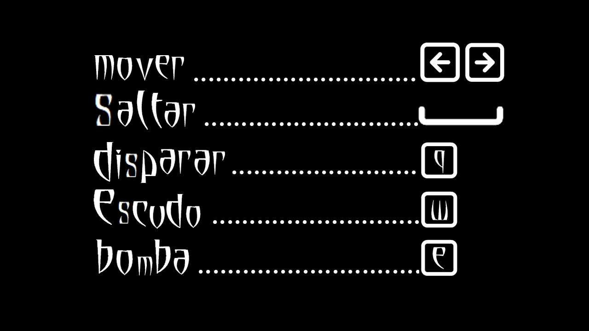

# CIIE
Repositorio para la creacion de un juego en 2D con Pygame y un juego en 3D usando Unity

## Skelly and Soulie (2D)

## Descripción
Skelly and Soulie es un juego de plataformas en 2D que cuenta con tres niveles y una batalla final. Ofrece dos resoluciones de pantalla (1280x720 y 720x405), tres niveles de dificultad y diálogos disponibles en inglés, castellano y gallego.

## Requisitos
Para ejecutar el juego desde el código fuente, se necesita tener instalado:
- Python 3.x
- Pygame

El juego también utiliza los módulos estándar de Python:
- `sys`
- `random`

## Instalación
### Windows
1. Necesario tener instalado Python 3.
2. Instalar las dependencias ejecutando:
   ```sh
   pip install pygame
   ```

### Linux
1. Necesario tener instalado Python 3.
2. Instalar las dependencias ejecutando:
   ```sh
   pip install pygame
   ```

## Ejecución
Para jugar desde el código fuente, desde la carpeta `src` ejecutar:
```sh
python main.py
```

Es posible jugarlo desde Windows desde el ejecutable, simplemente abrir `Skelly and Soulie.exe` en Windows.

## Ejecutable
Se incluye un ejecutable precompilado para Windows: `Skelly and Soulie.exe`.
Si se desea generar un nuevo ejecutable, usar el siguiente comando:
```sh
pyinstaller --onefile --windowed --name "Skelly and Soulie" \
--add-data "Art;Art" --add-data "ButtonText;ButtonText" \
--add-data "config;config" --add-data "Credits;Credits" \
--add-data "Dialog;Dialog" --add-data "Font;Font" \
--add-data "Sound;Sound" --add-data "save;save" main.py
```
Es necesario tambien eliminar de los archivos Load.py y event.py  "../src/" del string "../src/save"

## Estructura del Proyecto
```
Skelly_and_Soulie/
│── src/
│   ├── classes/
│   ├── enemies/
│   ├── game/
│   │   ├── objects/
│   │   │   ├── decor/
│   ├── save/
│   ├── utils/
│   ├── views/
│   ├── main.py
│── assets/
│   ├── Art/
│   │   ├── 1280x720/
│   │   ├── 720x405/
│   │   ├── common/
│   ├── ButtonText/
│   ├── config/
│   ├── Credits/
│   ├── Dialog/
│   ├── Font/
│   ├── Sound/
│   │   ├── BSO/
│   │   ├── FX/
```

```mermaid
classDiagram
class AnimationPlayer {
    - int amount
    - string art_path
    - list boxes
    - pygame.time.Clock clock
    - int end
    - int fps
    - image frame
    - int frame_index
    - string frame_path
    - list<images> frames
    - string path
    - bool running
    - pygame.display screen
    - int start
    + get_boxes(event)
    + run()
    + show_dialog()
}

class Base {
    - bool running
    - pygame.display screen
    - int screen_height
    - int screen_width
    + get_running() bool
    + run()
    + stop()
    + _cleanup()_
    + _handle_events()_
    + _render()_
    + _update()_
}

class Bat {
    - int direction
    - dict<string, List<Tuple>> frames
    - int lifes
    - float speed
    - image spritesheet
    - vector2 vel
    + move()
    + check_respawn()
}

class Boss {
    - int animation_timer
    - int attack
    - string current_action
    - int dash_duration
    - int dash_speed
    - int dash_timer
    - int direction
    - dict<string, List<Tuple>> frames
    - bool hit
    - pygame.mixer.Sound hurt_sound
    - int index
    - int lifes
    - pygame.mixer.Sound sound
    - int special_timer
    - float speed
    - image spritesheet
    - Vector2 vel
    + dash()
    + die()
    + draw(screen, position)
    + magic_attack()
    + move()
    + the_end()
    + update()
    + wounded()
}

class Breakable {
    - int animation_timer
    - bool breaking
    - int frame_rate
    - dict<string, List<Tuple>> frames
    - int height
    - int index
    - pygame.rect rect
    - pygame.mixer.Sound sound
    - image spritesheet
    - image surf
    - int width
    + draw(screen, position)
    + init_surf()
    + on_bomb_Collision()
    + start_break()
    + update()
}

class Button {
    - tuple base_color
    - Font font
    - image hover_image
    - image image
    - image image_icon
    - bool is_hovering
    - pygame.rect rect
    - pygame.mixer.Sound sound
    - image text
    - string text_input
    - pygame.rect text_rect
    - int x_pos
    - int y_pos
    + changeColor(position)
    + changeImage(position)
    + checkForInput(position)
    + make_sound()
    + render(screen)
    + update(position)
}

class Camera {
        - int bottom_margin
        - int left_margin
        - int offset
        - int right_margin
        - int screen_height
        - int screen_width
        - int top_margin
        - int world_height
        - int world_width
        + apply(rect)
        + check_elements_on_screen(elements)
        + update(target)
}

class Chest {
        - bool active
        - int animation_timer
        - bool discovered
        - int frame_rate
        - dict<string, List<Tuple>> frames
        - int height
        - int index
        - Prize prize
        - pygame.rect rect
        - int respaw_x
        - int respaw_y
        - int respawn_time
        - pygame.mixer.Sound sound
        - image spritesheet
        - image surf
        - int width
        + check_respawn()
        + draw(screen, position)
        + get_prize()
        + init_surf()
        + on_discover()
        + open()
        + set_prize(x, y, prize)
        + update()
}

class ConfigManager {
    <<singleton>>
        - string btn_text
        - dict<string, string> conf
        - int difficulty
        - Font font_dialog
        - Font fonts_text
        - Font fonts_titles
        - int fps
        - string language
        - dict<int, string> textos
        - dict<string, string> texts
        + change_language(language)
        + change_texts(language)
        + get_artpath()
        + get_audiobspath(name)
        + get_audiofxpath(name)
        + get_difficulty()
        + get_font()
        + get_font_dialog()
        + get_font_title()
        + get_fps()
        + get_height()
        + get_iconpath()
        + get_instance()
        + get_language()
        + get_player_Acc()
        + get_player_fric()
        + get_player_jump()
        + get_player_posx(p int)
        + get_player_posy(p int)
        + get_player_speed()
        + get_size_btn_ltt()
        + get_size_ltt()
        + get_stone_r()
        + get_stone_v()
        + get_text(key string)
        + get_text_button(key string)
        + get_width()
        + load_fonts()
        + update_config_difficulty(difficulty int)
        + update_config_lang(language string)
        + update_config_meassurement(path string)
}

class Credits {
        - dict<string, string> credits
        - Font font
        - int index
        - float last_update_time
        - string lines
        - bool running
        + music_on()
        + run()
}

class Devil {
        +int can_shoot
        +int direction
        +dict<string, List<Tuple>> frames
        +int lifes
        +Stone projectiles
        +float speed
        +image spritesheet
        +vector2 vel
        +check_bullets()
        +move()
        +shoot()
} 

class DialogBox {
        +image bg_image
        +list<string> dialog
        +Font font
        +image icon
        +int line_height
        +int margin
        +pygame.Display screen
        +int width
        +draw()
        +wrap_text()
}  

class Door {
        +int initial_y
        +pygame.rect rect
        +image surf
        +draw(screen: pygame.Display, position: tuple)
        +init_surf()
        +reset_back()
        +switch_position()
}

class Enemy {
        +int animation_timer
        +int change_direction_interval
        +string current_action
        +int frame_counter
        +dict<string, list<tuple>> frames
        +bool hit
        +int lifes
        +bool not_death
        +tuple objective
        +bool on_screen
        +pygame.rect rect
        +int respawn_time
        +int screen_height
        +int screen_width
        +pygame.mixer.Sound sound
        +image spritesheet
        +image surf
        +Vector2 vel
        +check_respawn()
        +collision_managment(platforms: sprite.group)
        +die()
        +draw(screen: pygame.display, position: tuple)
        +move()
        +set_objective()
        +update()
        +wounded()
}

class Entity {
  acc : Vector2
  action_frames : List<tuple>
  animation_map : dict<string, function>
  animation_timer : int
  current_action : str
  direction : int
  end_index : int
  frame_rate : int
  group : sprite.group
  height : int
  index : int
  jumping : bool
  pos : Vector2
  rect : pygame.rect
  respawn_x : int
  respawn_y : int
  speed : int
  surf : image
  vel : Vector2
  width : int
  other_animation()
  render()
  resolve_collisions(hit pygame.rect, vertical_margin int)
  update_rect()
}

class Event {
        +int level
        +string path
        +pygame.mixer.Sound sound
        +bool triggered
        +no_key(life)
        +on_collision(player)
}

class Extra {
        +bool inUse
        +pygame.mixer.Sound sound
        +bool to_pick
        +being_pick()
        +get_can_pick()
        +set_use()
}

class Fireball {
        +int animation_timer
        +int counter
        +int direction
        +int frame_rate
        +dict<string, list<tuple>> frames
        +int height
        +image image
        +bool inUse
        +int index
        +string path
        +pygame.rect rect
        +pygame.mixer.Sound sound
        +int speed
        +int vel_y
        +int width
        +active(x: int, y: int, direction: int)
        +animation()
        +hit()
        +stand_by()
        +update(object)
}

class Game {
        +int FPS
        +image bg
        +dict<string, Button> buttons
        +Camera camera
        +pygame.time.clock clock
        +sprite.group group_lifes
        +sprite.group in_scene
        +sprite.group in_scene_now
        +string path
        +Player player
        +bool running
        +Scene scene
        +pygame.mixer.Sound sound
        +sprite.group sprites
        +int world_height
        +int world_width
        +cleanup()
        +collision()
        +handle_events()
        +render()
        +run()
        +update()
}

class GameManager {
    <<singleton>>
        +pygame.time.clock clock
        +bool music
        +NoneType next_scene
        +Player player
        +Base scene
        +pygame.Display screen
        +changeMusic(path: string)
        +change_resolution()
        +end_game()
        +first_scene()
        +get_clock()
        +get_instance()
        +get_player()
        +load_credits()
        +load_game(scene: Base, sound: string, level: int)
        +load_loading()
        +load_menu()
        +load_options()
        +load_pause()
        +load_player(level: int, lifes: int)
        +load_start(path: string)
        +music_on()
        +player_position()
        +run()
        +scene_end()
}

class GameOver {
        +image bg
        +Button button
        +bool running
        +cleanup()
        +handle_events()
        +render()
        +update()
}

class Ghost {
        +int direction
        +dict<string, List<tuple>> frames
        +float speed
        +image spritesheet
        +Vector2 vel
        +move()
}

class Heart {
        +float acc
        +int animation_timer
        +int direction
        +int frame_rate
        +dict<string, list<tuple>> frames
        +int height
        +int image
        +int index
        +sprite.group platform
        +pygame.rect rect
        +pygame.mixer.Sound sound
        +int speed
        +int vel_y
        +int width
        +active(x: int, y: int, direction: int)
        +animation()
        +set_Platform(platform: sprite.group)
        +stand_by()
        +update()
}

class Key {
        +pygame.mixer.Sound sound
        +update(object)
}

class Lifes {
        +pygame.rect rect
        +draw(screen: pygame.display)
}

class Load {
        +image bg
        +dict<string, Button> buttons
        +bool running
        +pygame.Display screen
        +cleanup()
        +get_player_lifes(level_file: string)
        +handle_events()
        +new_buttons()
        +process_saves_in_directory()
        +render()
        +update()
}

class Lungs {
  +pygame.mixer.Sound sound  
}

class Menu {
        +image bg
        +dict<string, Button> buttons
        +bool running
        +pygame.display screen
        +cleanup()
        +handle_events()
        +new_buttons()
        +render()
        +update()
}

class OneUse {
        +image image
        +bool inUse
        +bool on_screen
        +pygame.rect rect
        +image spritesheet
        +int x_pos
        +int y_pos
        +active(x: int, y: int, direction: int)
        +draw(screen: pygame.display, position: tuple)
        +get_inUse()
        +set_use()
}

class Options {
        +String BACK
        +String DIFFICULTY
        +String LANGUAGE
        +String RESOLUTION
        +String bg
        +String big
        +dict<String, Button> buttons
        +String easy
        +String font
        +String hard
        +String medium
        +String op_1
        +String op_2
        +String op_3
        +bool running
        +int screen_height
        +int screen_width
        +String small
        +change_language(language: string)
        +change_resolution(path: string)
        +cleanup()
        +handle_events()
        +new_buttons()
        +render()
        +update()
}

class Pausa {
        +int FPS
        +dict<string, Button> buttons
        +pygame.time.clock clock
        +bool running
        +handle_events()
        +render()
        +run()
        +update()
}

class Platforms {
        +int height
        +bool on_screen
        +pygame.rect rect
        +image surf
        +int width
        +int x_pos
        +int y_pos
        +draw(screen: pygame.display, position: tuple)
        +init_surf()
}

class Player {
        +float ACC
        +float FRIC
        +vector2 acc
        +dict<pygame.key, function> action_map
        +int animation_timer
        +string current_action
        +pygame.mixer.Sound death_sound
        +int death_timer
        +bool die
        +int direction
        +dict<string, list<tuple>> frames
        +bool got_key
        +bool got_life
        +int height
        +int index
        +int jump_Max
        +bool jumping
        +int lifes
        +sprite.group platform
        +vector2 pos
        +bool power_up
        +int power_up_counter
        +pygame.mixer.Sound power_up_sound
        +Stone projectiles
        +bool pushing
        +int respawn_x
        +int respawn_y
        +bool shooting
        +int speed
        +image spritesheet
        +image surf
        +Vector2 vel
        +int width
        +int y_acc_value
        +animation_death()
        +check_power_up()
        +collision_managment(platforms sprite.group)
        +draw(screen pygame.display, position tuple)
        +end_of_death()
        +end_shooting()
        +get_group()
        +get_life(hit pygame.rect)
        +get_lifes()
        +handle_idle()
        +handle_jump()
        +handle_shoot()
        +handle_walk_left()
        +handle_walk_right()
        +move()
        +set_platform(platform sprite.group)
        +shoot()
        +to_die()
        +update()
}

class Player1 {
        +string current_action
        +int index
        +int lifes
        +bool shield
        +animation_shield()
        +handle_shield()
        +move()
        +to_die()
}

class Player2 {
        +int bomb_counter
        +bool bombing
        +string current_action
        +Heart heart
        +int index
        +animation_bomb()
        +explode()
        +handle_bomb()
        +move()
        +update()
}

class Prize {
        +int counter
        +int height
        +bool inUse
        +pygame.rect rect
        +pygame.mixer.Sound sound
        +int width
        +update(object)
}

class Scene {
        +image background
        +sprite.group enemies
        +sprite.group it
        +dict<string, Array<Array>> items
        +sprite.group platform
        +create_scene()
}

class Start {
        +AnimationPlayer animation
        +dict<string, string> info
        +bool running
        +int screen_height
        +int screen_width
        +cleanup()
        +music_on()
        +run()
}

class Stone {
        +int counter
        +int height
        +image image
        +string path
        +int speed
        +int speed_d
        +int width
        +active(x int, y int, direction int)
        +hit()
        +stand_by()
        +update(object)
}

class Switch {
        +int counter
        +Door door
        +dict<String, list<tuples>> frames
        +int height
        +bool pressed
        +pygame.rect rect
        +pygame.mixer.Sound sound
        +image spritesheet
        +image surf
        +int time
        +int width
        +change_position()
        +draw(screen pygame.display, position tuple)
        +get_door()
        +init_surf()
        +reset()
        +update()
}


  Credits --|> Base
  Game --|> Base
  GameOver --|> Base
  Load --|> Base
  Menu --|> Base
  Options --|> Base
  Pausa --|> Base
  Start --|> Base
 
  Chest --|> Platforms
  Breakable --|> Platforms
  Door --|> Platforms
  Event --|> Platforms
  Spikes --|> Platforms

  Extra --|> Prize
  Key --|> Prize
  Lungs --|> Prize

  Fireball --|> OneUse
  Heart --|> OneUse
  Lifes --|> OneUse
  Prize --|> OneUse
  Stone --|> OneUse

  Bat --|> Enemy
  Boss --|> Enemy
  Devil --|> Enemy
  Ghost --|> Enemy

  Player --|> Entity
  Enemy --|> Entity 

  Player2 --|> Player1

  Player1 --|> Player
  
  Entity --|> Sprite
  OneUse --|> Sprite
  Platforms --|> Sprite


```

## De interés



Para poder interactuar con el juego, debemos distinguir entre:

- **Interacciones con la UI:** Se utilizará el ratón y el botón izquierdo del mismo. Estas interacciones incluyen acceder a menús, saltar animaciones, escoger opciones, pausar el juego y salir del programa.

- **Interacciones del juego o jugabilidad:** Se usará principalmente el teclado (ver imagen "Controles").  
  - **Flechas direccionales:** Mueven al personaje hacia adelante y atrás.  
  - **Barra espaciadora:** Controla el salto.  
  - **"Q":** Dispara (habilitado desde el nivel 1).  
  - **"W":** Activa el escudo (habilitado desde el nivel 2).  
  - **"E":** Lanza la bomba rompe-plataformas (habilitado desde el nivel 3).  

## Consejos 

Para disfrutar del juego, puede ser útil conocer ciertos detalles. Sin embargo, algunos jugadores pueden preferir descubrir todo por sí mismos. Para quienes prefieran una guía, aquí dejamos información clave:

- **Skelly solo cuenta con un disparo a la vez.** Si la piedra aún no ha impactado o salido de la pantalla, no será posible volver a disparar.
- **El escudo se activa y desactiva entre usos.** No es recomendable avanzar con él siempre activado.
- **La bomba solo destruye plataformas rompibles.** Estas plataformas son más cortas que las normales y solo aparecen en el nivel 3.
- **Los enemigos y cofres reaparecen.** Si se pierde un power-up necesario, solo hay que esperar a que vuelva a aparecer.
- **El camino más obvio no siempre es el correcto.** Si no se puede avanzar, puede ser necesario explorar alternativas.
- **No todos los enemigos deben ser eliminados.** Un enfrentamiento directo no siempre es necesario.


